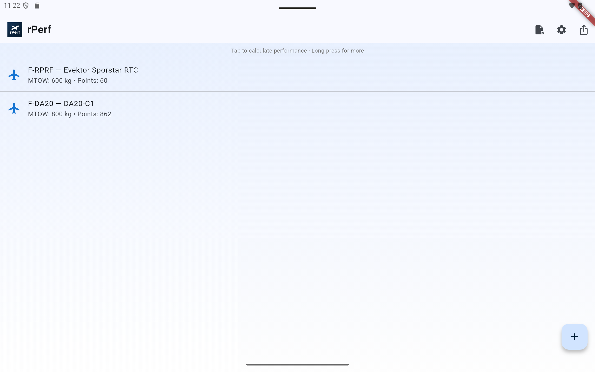
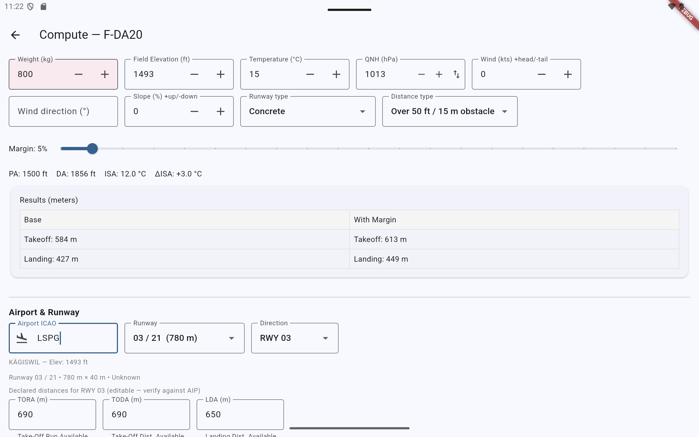
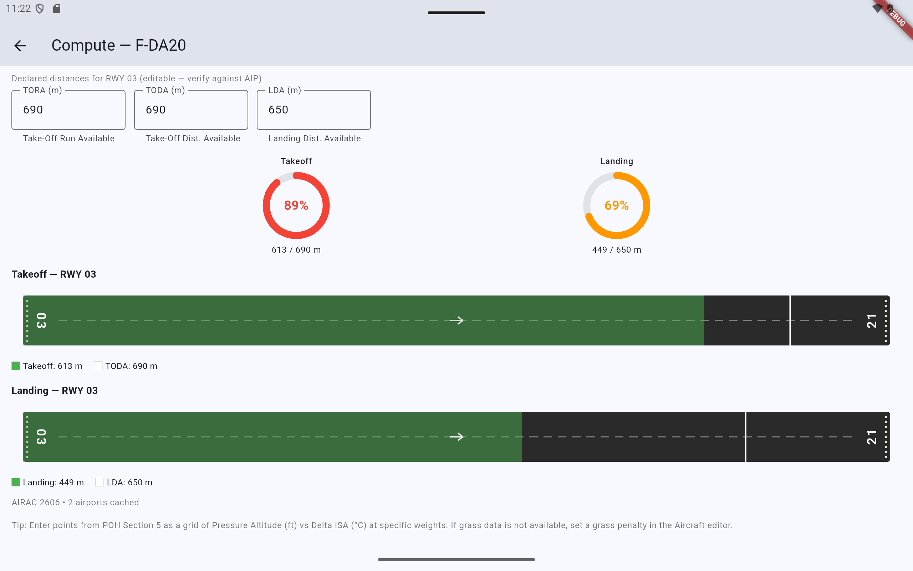

<p align="center">
  
</p>

<h1 align="center">rPerf</h1>

<p align="center">
  Takeoff & Landing Performance Calculator for General Aviation
</p>

<p align="center">
  <a href="https://github.com/diaznet/rPerf/actions/workflows/dev.yml"></a>
  <a href="https://github.com/diaznet/rPerf/actions/workflows/release.yml"></a>
  
  
  
</p>

---

## Screenshots

<p align="center">
  
</p>
<p align="center">
  
</p>
<p align="center">
  
</p>

---

## What is rPerf?

rPerf is a mobile/desktop aviation app that calculates takeoff and landing performance for general aviation aircraft. Pilots enter performance data from their Pilot's Operating Handbook (POH) and the app interpolates distances for any given set of conditions.

## Features

- **Multi-dimensional interpolation** — weight × pressure altitude × delta ISA for accurate distance computation
- **Aircraft profiles** — manage multiple aircraft with full POH performance data
- **Airport & runway lookup** — on-demand data from OpenAIP with AIRAC-cycle-aware caching
- **Runway visualization** — go/no-go overlay comparing computed distance vs available runway
- **Performance gauges** — circular indicators showing runway usage percentage
- **Wind analysis** — headwind/crosswind decomposition with visual wind rose
- **Correction factors** — wind, slope, and grass surface penalties
- **Safety margin** — configurable 0–100% margin on top of computed distances
- **Extrapolation warning** — alerts when inputs exceed the POH data envelope
- **Import/Export** — CSV format compatible with the rPerf-Tools digitizer

## Quick Start

```bash
flutter pub get
flutter run
```

## Data Workflow

1. Digitize POH charts using [rPerf-Tools](https://github.com/diaznet/rPerf-Tools)
2. Export CSV from the Aircraft Profile Generator
3. Import into rPerf via the aircraft list menu

## Tech Stack

| Component | Technology |
|-----------|-----------|
| Framework | Flutter (Material 3) |
| Language | Dart ≥3.3 |
| Storage | Hive (local NoSQL) |
| API | OpenAIP (airport/runway data) |
| Platforms | Android, iOS, Desktop |

## Build

```bash
flutter build apk --release        # Android
flutter build ios --release         # iOS
dart run build_runner build         # Regenerate Hive adapters
```

## Project Structure

```
lib/
├── main.dart              # App entry, splash screen
├── models/                # Hive-persisted data models
├── pages/                 # Full-screen pages (list, edit, compute)
├── services/              # Business logic (interpolation, calculations, API)
└── widgets/               # Reusable UI components
```

## Related

- **[rPerf-Tools](https://github.com/diaznet/rPerf-Tools)** — POH chart digitizer and aircraft profile generator

---

<p align="center">
  <em>Built for pilots, by a pilot.</em>
</p>
